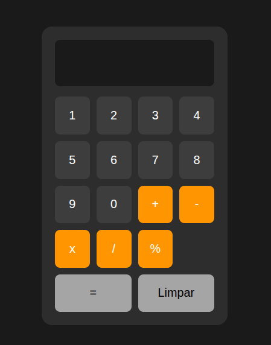

🧮 Calculadora JavaScript

📌 Sobre o Projeto

Calculadora desenvolvida com HTML, CSS e JavaScript puro, sem o uso de nenhuma biblioteca ou framework externo. O projeto foi criado com foco em praticar manipulação do DOM, eventos e lógica de programação.

✨ Funcionalidades

➕ Adição
➖ Subtração
✖️ Multiplicação
➗ Divisão
🔄 Operações encadeadas (o resultado de uma conta pode ser usado na próxima)
🧹 Botão de limpar que reseta todos os valores

📂 Estrutura do Projeto

calculadora/
│
├── index.html     # Estrutura da página
├── style.css      # Estilização
└── script.js      # Lógica da calculadora

🧠 Conceitos Praticados

Manipulação do DOM com getElementById e querySelectorAll
Eventos com addEventListener
Percorrer listas de elementos com forEach
Variáveis de estado para controlar o fluxo da calculadora
Conversão de string para número com parseFloat
Condicionais if para selecionar a operação correta